<div align="center">



<br>

**A transformer is not a black box. It is a box nobody bothered to open.**

Glass Box runs a real language model on your machine, reads every activation as it fires, and draws
the whole thing in 3D — attention heads, MLP neurons, the residual stream, and the tree of every
token the model considered but did not say. Then it hands you a slider that changes what the model
believes, live, without touching a single weight.

<br>


<br>


<br><br>

### `setup.bat` → `start.bat` → open `localhost:5173`

<sub>No API key. No cloud. No telemetry. The model, the weights, and every number you see stay on your disk.</sub>

</div>

---

## Contents

| | |
|---|---|
| [Why this exists](#why-this-exists) | The gap between *"it works"* and *"I know why"* |
| [The four views](#the-four-views) | Circuit · Stream · Neurons · Response tree |
| [Activation steering](#activation-steering) | Build a direction, add it to the stream, watch the answer bend |
| [The response tree](#the-response-tree) | Every road not taken, kept on screen |
| [Architecture](#architecture) | How a click becomes a hooked forward pass |
| [Getting started](#getting-started) | Complete, copy-pasteable, Windows + macOS + Linux |
| [Your first five minutes](#your-first-five-minutes) | A guided tour with real prompts |
| [API reference](#api-reference) | Thirteen endpoints, one SSE stream |
| [Configuration](#configuration) | Every environment variable |
| [Project layout](#project-layout) | Where everything lives |
| [Under the hood](#under-the-hood) | The engineering that made it hold 60fps |
| [Honest limits](#honest-limits) | What the numbers do *not* claim |
| [Further reading](#further-reading) | The work this is built on |

---

## Why this exists

Ask a language model for the capital of France and you get `Paris`. Ask it *why* and you get a story
it invented after the fact. The real reason is a few hundred million multiply-accumulates you never
see — an attention head three layers down that learned to copy the token after a repeat, a neuron in
layer 7 that fires on landmarks, a residual stream that already knew the answer at layer 6 and spent
five more layers polishing the wording.

Mechanistic interpretability is the field that reads those internals directly instead of guessing.
The catch is that the tooling is notebooks: write a hook, print a tensor, squint at a heatmap, lose
the thread. The mental model lives in the researcher's head and never makes it onto the screen.

**Glass Box makes the internals the interface.** The model stops being a thing you query and becomes
a building you walk around inside.

> Three things fall out of that, and all three are the point:
>
> 1. **You see structure you were not looking for.** Induction heads light up in a shape you
>    recognise before you have computed a single score.
> 2. **You intervene while looking.** The slider and the visualisation are the same object, so cause
>    and effect arrive together instead of one notebook cell apart.
> 3. **Anyone can watch.** A curious ten-year-old, a product manager, and a PhD student all see the
>    same animation. Only the third one needs the vocabulary.

---

## The four views

One canvas, four ways of looking at the same forward pass. Switch between them from the top bar; the
camera is free in all of them — orbit, pan, and zoom anywhere, at any depth.

<table>
<tr>
<td width="50%" valign="top">

### ◈ Circuit

**The anatomy view.**

Each layer is a disc. Each attention head is a pillar rising out of it, and the pillar's height is
that head's **direct logit attribution** — how much it pushed the winning token, measured by
decomposing the residual stream with `stack_head_results` and projecting through the folded final
layer norm and unembedding.

Arcs sweep between token positions to show where a head is actually looking. Click any pillar and
the inspector names its behaviour, computed from *this* prompt rather than looked up in a table:

`previous-token` · `induction` · `duplicate-token` · `attention-sink` · `self`

</td>
<td width="50%" valign="top">

### ◈ Stream

**The trajectory view.**

Every token position becomes a tube running through all layers, its path traced by projecting the
residual stream into 3D.

The projection is fitted **per layer**, not once globally. A single global PCA is dominated by the
huge norms of the last few layers and flattens everything early into a dot — the interesting motion
is in the first half, and it only survives if each layer gets its own basis.

What you are watching is a representation being rewritten: the vector for a word entering as an
embedding and leaving as a prediction.

</td>
</tr>
<tr>
<td width="50%" valign="top">

### ◈ Neurons

**The activity view.**

A field of MLP neurons, one point per neuron, brightness driven by live activation. During
generation the backend reads `mlp.hook_post` at the exact position being written, so these are the
neurons responsible for *this* token — not a prompt-wide average that smears everything into mush.

The top *k* per layer stream down with each token (default 6, configurable per request), sent as
parallel arrays instead of objects because at 12 layers × 60 tokens the object form triples the
payload for no extra information.

</td>
<td width="50%" valign="top">

### ◈ Response tree

**The decision view.**

The one that changes how people think about sampling. Instead of a line of text, the answer grows as
a tree: the spine is what the model said, and every branch is something it *nearly* said, with its
probability attached.

Nothing is ever deleted. Rejected candidates stay dimmed in place. Double-click one and the model
rewinds to that exact token prefix and writes a different future, which claims its own row and keeps
growing beside the original.

Detailed below — [jump there](#the-response-tree).

</td>
</tr>
</table>

Two more readouts sit in the side column, available in every view:

- **Logit lens** — decode the residual stream at *every* layer through the unembedding, and read off
  what the model would have said if it had to answer from that depth. This is how you watch a belief
  form: usually wrong and diffuse early, sharpening somewhere in the middle, locked in well before
  the last layer.
- **Narrator** *(optional)* — pipe the measurements to any OpenAI-compatible local server (LM Studio,
  Ollama, llama.cpp) and get a plain-English commentary on what just happened. Deliberately a
  *second* model: the specimen must stay unhooked and honest, and a chat API returns text only — no
  activations — so it can never be the thing under the microscope.

---

## Activation steering

<div align="center">

</div>

This is the Golden Gate Claude trick, running on your laptop, on a model small enough to watch.

The mechanism is simpler than it sounds and the diagram above is the whole of it:

1. **Contrast.** Take a set of prompts that carry the concept and a set that does not.
2. **Difference.** Run both through the model, capture the residual stream at layer *L*, and subtract
   the negative mean from the positive mean. What survives the subtraction is the direction in
   activation space that *means* the concept.
3. **Inject.** Register a forward hook on `blocks.L.hook_resid_post` that adds `strength × direction`
   to the stream at every position, on every forward pass, while the model generates.
4. **Watch it bend.** Same weights, same seed, different answer.

Strength is scaled by `referenceNorm / 10` — a multiple of that layer's typical residual norm — so
the same slider value means roughly the same thing across layers and across models.

**Nothing is fine-tuned. Nothing is written to disk. Remove the hook and the model is bit-for-bit
what it was.** That reversibility is what makes it a laboratory instead of a modification.

### The six built-in presets

Each ships as a contrast set, a colour, and a suggested layer expressed as a fraction of the model's
depth, so it lands sensibly whether you loaded a 12-layer GPT-2 or a 26-layer Gemma.

| | Preset | Effect | Suggested layer | Default strength |
|:-:|---|---|:-:|:-:|
| 🟠 | **Golden Gate Bridge** | The bridge intrudes into every answer | ~50% depth | `0.55` |
| 🔴 | **Anger** | Register turns hot and clipped | ~50% depth | `0.50` |
| 🟣 | **Pirate Speak** | Nautical dialect bleeds through | ~45% depth | `0.45` |
| 🔵 | **Python Code** | Prose drifts toward syntax | ~40% depth | `0.40` |
| 🔷 | **Extreme Formality** | Diction inflates, contractions vanish | ~50% depth | `0.50` |
| 🩷 | **Dreamlike** | Logic loosens, imagery thickens | ~55% depth | `0.55` |

Build your own from the steering panel: type positive examples, negative examples, pick a layer, and
the backend returns the vector plus the tokens it most strongly promotes — an immediate sanity check
on whether you captured the concept you meant to.

### Which layer should you steer?

Empirically, on GPT-2 small:

| Depth | What happens | Use it for |
|---|---|---|
| **L0 – L2** | The signal washes out. Later layers overwrite it. | Almost nothing. |
| **L5 – L8** | **The sweet spot** — L6 is the best single choice. Meaning changes; grammar survives. | Real steering. |
| **L10 – L11** | Immediate and brutal. The token flips, fluency breaks. | Demonstrating that the lever is real. |

The reason is structural: early layers are still assembling *what the tokens are*, the middle is
where *what this is about* lives, and the last layers are committing to surface form. Steer the
middle and you change the thought. Steer the end and you only change the word.

### A/B compare

The compare endpoint runs a baseline and a steered continuation **in lockstep from a single shared
seed**. That is what makes the comparison legible: both runs are identical, token for token, until
the intervention actually changes the model's mind — and the exact token where they diverge is
flagged in the stream.

---

## The response tree

<div align="center">

</div>

Autoregressive generation is usually shown as a line, which quietly lies about what happened. At
every step the model ranked the entire vocabulary and one token won. The line shows you the winners
and throws away the election.

The tree keeps the election.

- **The spine** is the path taken. Each node carries the token, its probability, and the entropy of
  the distribution it came from — so a confident step and a coin-flip step *look* different.
- **The branches** are the top alternatives at that step, dimmed but permanent. Nothing you have seen
  ever disappears.
- **Neurons fire on the winner.** As each token lands, the MLP neurons responsible for it pulse in
  place, so causation is visible rather than inferred.
- **Double-click a rejected branch** and generation resumes from that exact point.

That last one is the part that takes real care. The UI does not re-tokenise a partial string —
re-tokenisation can merge characters differently and silently change what the model sees. Every node
stores `contextIds`, the exact integer prefix the model consumed before writing it, and the rewind
replays those ids verbatim. The branch is byte-exact.

Branches lay out on a **fishbone**: the spine stays perfectly straight at `y=0, z=0`, dead-end
candidates recycle their rows, and any branch you actually explore claims a row of its own and steps
one plane toward the camera. Explore a dozen and it stays readable.

---

## Architecture

```
┌────────────────────────────── BROWSER ──────────────────────────────┐
│                                                                     │
│   React 18 + TypeScript          Zustand store                      │
│   ┌──────────────────┐           fine-grained selectors so a token  │
│   │  Panels (8)      │◀─────────▶ arriving at 60Hz re-renders one   │
│   │  Prompt Steering │           subscriber, not the tree           │
│   │  Inspect  Lens   │                    ▲                         │
│   │  Output   Narrate│                    │                         │
│   │  TokenStrip TopBar                    │                         │
│   └──────────────────┘                    │                         │
│   ┌──────────────────────────────────────┴──────────────────────┐   │
│   │  react-three-fiber · three.js r169 · postprocessing bloom   │   │
│   │  LayerDiscs · HeadPillars · AttentionArcs · ResidualTunnel  │   │
│   │  NeuronField · TokenRing · ResponseScene                    │   │
│   └─────────────────────────────────────────────────────────────┘   │
└──────────────────────────────────┬──────────────────────────────────┘
                                   │  Vite dev proxy, :5173 → :8000
                                   │  cache-control: no-transform
                                   │  (or SSE frames get buffered
                                   │   and the stream arrives as a lump)
                     ┌─────────────▼─────────────┐
                     │   fetch + ReadableStream  │
                     │   POST-based SSE reader   │
                     └─────────────┬─────────────┘
┌──────────────────────────────────▼──────────────────────────────────┐
│                        FastAPI · uvicorn :8000                      │
│                                                                     │
│   main.py       13 endpoints · _pin_sync_generator SSE bridge       │
│   generate.py   hooked generation · nucleus sampling · A/B compare  │
│   interpret.py  DLA · head classification · logit lens · per-layer  │
│                 PCA · top-k neurons                                 │
│   steering.py   contrast sets → mean difference → vector store      │
│   model_loader.py  registry + exclusive() lock + local GGUF path    │
│   presets.py    six curated contrast sets                           │
│   narrator.py   optional OpenAI-compatible client                   │
│   schemas.py    pydantic request/response models                    │
│   config.py     every knob, all env-overridable                     │
└──────────────────────────────────┬──────────────────────────────────┘
                                   │
                  ┌────────────────▼────────────────┐
                  │  TransformerLens HookedTransformer │
                  │  fold_ln · center_writing_weights  │
                  │  forward hooks on:                 │
                  │    blocks.L.hook_resid_post        │
                  │    blocks.L.attn.hook_z            │
                  │    blocks.L.mlp.hook_post          │
                  │    blocks.L.hook_mlp_out           │
                  └────────────────┬───────────────────┘
                                   │
                        ┌──────────▼──────────┐
                        │  PyTorch · CPU/CUDA │
                        │  GPT-2 · Pythia ·   │
                        │  Gemma (local GGUF) │
                        └─────────────────────┘
```

### The path of a single click

```
 Generate pressed
      │
      ├─▶ window CustomEvent 'glassbox:generate'          decouples the button
      │                                                    from the stream owner
      ├─▶ POST /api/generate  { prompt, steering[], ablateHeads[], seed, … }
      │
      ├─▶ registry.exclusive()      one request at a time — steering hooks live
      │                             on the shared model, so a concurrent request
      │                             would silently inherit this intervention
      │
      ├─▶ encode_prompt()           applies the chat template if the model has
      │                             one; a bare string makes an instruct model
      │                             continue the document instead of answering
      │
      ├─▶ build_hooks()             steering + head ablation + MLP ablation
      │
      └─▶ for each step:
             forward pass under hooks
             read resid norms (trace hook) and mlp.hook_post (neuron hook)
             nucleus sample
             stop token? → break before appending, so control markers
                           never become nodes in the tree
             yield { token, prob, entropy, alternatives[5],
                     contextIds[], layerNorms[], firing[] }
                          │
                          └─▶ SSE frame ─▶ Zustand ─▶ tree layout ─▶ GPU
```

---

## Getting started

### Prerequisites

| | Minimum | Notes |
|---|---|---|
| **Python** | 3.10+ | 3.11 recommended |
| **Node.js** | 18+ | For the Vite dev server |
| **RAM** | 4 GB free | GPT-2 small on CPU |
| **Disk** | ~1.5 GB | Torch, then ~500 MB for the first checkpoint |
| **GPU** | Not required | CUDA used automatically if present |

### Windows — the two-command path

```bash
setup.bat
```

Creates the virtual environment, installs the Python dependencies, and runs `npm install` in
`frontend/`. One time only.

```bash
start.bat
```

Launches both processes: the API on `http://127.0.0.1:8000` and the UI on `http://localhost:5173`.
Open the second one.

### macOS and Linux

```bash
python3 -m venv .venv && source .venv/bin/activate && pip install -r requirements.txt && (cd frontend && npm install)
```

```bash
./start.sh
```

### Manual, two terminals

Use this when you want to watch the backend log while the UI runs — during development it is the
better option, because a Python traceback is far easier to read in its own window.

**Terminal 1 — the API**

```bash
python -m uvicorn backend.main:app --host 127.0.0.1 --port 8000 --reload
```

**Terminal 2 — the UI**

```bash
cd frontend && npm run dev
```

Then open **http://localhost:5173**.

### First run

The first launch downloads GPT-2 (~500 MB) from Hugging Face and caches it under `~/.cache/huggingface`.
The loading overlay stays up while that happens. Every later start takes seconds.

Confirm the backend is alive before you debug anything else:

```bash
curl http://127.0.0.1:8000/api/status
```

```json
{"model":{"name":"gpt2","nLayers":12,"nHeads":12,"dModel":768,"dMlp":3072,"dVocab":50257,"nCtx":1024,"device":"cpu"}}
```

### Troubleshooting

<details>
<summary><b>The UI loads but says it cannot reach the backend</b></summary>

<br>

The frontend talks to `/api`, which Vite proxies to `127.0.0.1:8000`. If the backend is not up, or is
bound to a different port, that proxy fails. Check `curl http://127.0.0.1:8000/api/status`, and if
you changed `GLASSBOX_PORT`, update the `target` in `frontend/vite.config.ts` to match.

</details>

<details>
<summary><b>Port 5173 or 8000 is already in use</b></summary>

<br>

A leftover dev server from a previous session is the usual cause.

```bash
netstat -ano | grep -E "5173|8000"
```

Take the PID from the last column and `taskkill //PID <pid> //F` on Windows, or `kill -9 <pid>`
elsewhere.

</details>

<details>
<summary><b>Tokens appear all at once instead of streaming</b></summary>

<br>

Something between the browser and uvicorn is buffering the SSE stream. The Vite config already sets
`cache-control: no-cache, no-transform` on proxied responses for exactly this reason. If you put
nginx or another proxy in front, it needs `proxy_buffering off`.

</details>

<details>
<summary><b>Generation hangs forever on the very first click</b></summary>

<br>

Fixed, and worth knowing about — see [Under the hood](#under-the-hood). Starlette iterates a plain
sync generator on a thread pool where a *different worker can serve every* `next()`, while the
generator holds a `threading.RLock` across yields. An RLock cannot be released from a thread that
does not own it, so the server wedged permanently. `_pin_sync_generator` pins the whole generator to
one dedicated daemon thread and pushes frames through an `asyncio.Queue`.

</details>

<details>
<summary><b>An instruction-tuned model returns gibberish or continues the document</b></summary>

<br>

It needs its chat template. `encode_prompt()` applies one automatically when the tokenizer has it,
and `stop_ids()` recognises `<end_of_turn>`, `<|im_end|>`, and `<|eot_id|>` alongside the plain EOS —
with a guard so a marker the model does not have is not mistaken for the unk token and treated as a
stop.

</details>

<details>
<summary><b>Running Gemma 3 270M from a local GGUF</b></summary>

<br>

The Hugging Face repo is gated, but LM Studio's GGUF works offline. `model_loader.py` looks for:

```
~/.lmstudio/models/lmstudio-community/gemma-3-270m-it-GGUF/gemma-3-270m-it-Q8_0.gguf
```

and dequantizes it through `AutoModelForCausalLM.from_pretrained(dir, gguf_file=...)`, then injects
the result into `HookedTransformer`. This path needs `gguf>=0.10.0`, which is already in
`requirements.txt`.

Note that `center_writing_weights` and `center_unembed` are disabled on this path: Gemma ties its
unembedding to its embedding and scales the residual stream by `sqrt(d_model)`, and re-centring those
shifts the logits enough to change which token wins.

</details>

---

## Your first five minutes

**1 — Watch an induction head do its job.**

```
Vernon Dursley and Petunia Durs
```

Hit **Analyse**, open the Circuit view, and look for a pillar in the middle layers with a long arc
reaching back to the earlier `Durs`. That is an induction head: it noticed the repetition and is
copying what followed last time. Click it and the inspector should agree.

**2 — Find where the model makes up its mind.**

```
The capital of France is Paris. The capital of Japan is
```

Open the **Lens** tab and read down the layers. `Tokyo` will not be at the top early on. Somewhere in
the middle it arrives and then never leaves — that layer is where the answer was decided, and every
layer after it is editorial.

**3 — Break something on purpose.**

Ablate the head you found in step 1 and re-run. Watch the prediction degrade. Ablation is the
cleanest evidence a circuit exists: remove it, lose the behaviour.

**4 — Steer.**

Load the **Golden Gate Bridge** preset, set the layer near the middle, and push strength to `0.55`.
Now generate from something entirely unrelated:

```
I am thinking about what to have for dinner
```

The bridge shows up anyway. That is a single vector, added to one layer, out-arguing the prompt.

**5 — Take a different road.**

Switch to the **Response tree**, find a step where the top two candidates were close, and double-click
the one the model rejected. It rewinds to that exact prefix and writes a new continuation on its own
row — with the original still sitting there for comparison.

---

## API reference

Base URL `http://127.0.0.1:8000`. Everything is JSON except the two streams, which are
`text/event-stream`.

| Method | Endpoint | Purpose |
|---|---|---|
| `GET` | `/api/status` | Loaded model, dimensions, device, limits |
| `POST` | `/api/model/load` | Swap to another model from `AVAILABLE_MODELS` |
| `POST` | `/api/analyze` | Full static read: attention, DLA, head classes, per-layer PCA, logit lens, top neurons |
| `POST` | `/api/generate` | **SSE** — one frame per token, with alternatives, entropy, `contextIds`, layer norms, and firing neurons |
| `POST` | `/api/compare` | **SSE** — baseline and steered runs in lockstep from one seed, with the divergence point flagged |
| `GET` | `/api/presets` | The six built-in contrast sets |
| `GET` | `/api/vectors` | Every steering vector currently in the store |
| `POST` | `/api/vectors/build` | Build a vector from your own positive/negative prompts |
| `POST` | `/api/vectors/preset` | Build a vector from a preset id at a chosen layer |
| `GET` | `/api/vectors/{id}/tokens` | The tokens a vector most strongly promotes |
| `DELETE` | `/api/vectors/{id}` | Remove a vector |
| `GET` | `/api/narrator/health` | Whether the optional local narrator is reachable |
| `POST` | `/api/narrate` | Ask the narrator to explain the current measurements |

<details>
<summary><b>Example — stream a steered generation from the command line</b></summary>

<br>

```bash
curl -N -X POST http://127.0.0.1:8000/api/generate \
  -H 'Content-Type: application/json' \
  -d '{"prompt":"The bridge was","maxNewTokens":24,"temperature":0.8,"seed":0,"trackNeurons":true,"neuronsPerLayer":6}'
```

Each frame looks like this:

```
data: {"type":"token","step":3,"token":" fog","tokenId":30371,"prob":0.184,
       "entropy":3.91,"contextIds":[464,7696,373,...],
       "alternatives":[{"token":" built","tokenId":3170,"p":0.211}, ...],
       "layerNorms":[41.2,58.7,...],"firing":[{"l":6,"n":[1487,...],"a":[3.21,...]}]}
```

and the stream closes with:

```
data: {"type":"done","text":" fog rolled in under the...","tokenCount":24,"tokenIds":[...]}
```

</details>

---

## Configuration

Every setting is an environment variable, so you can retarget the app without editing code.

| Variable | Default | What it does |
|---|---|---|
| `GLASSBOX_MODEL` | `gpt2` | Any model name TransformerLens understands |
| `GLASSBOX_DEVICE` | `auto` | `cpu`, `cuda`, or `auto` |
| `GLASSBOX_MAX_TOKENS` | `48` | Prompt truncation limit — attention is O(n²) per head, and this is what keeps the payload renderable |
| `GLASSBOX_HOST` | `127.0.0.1` | Backend bind address |
| `GLASSBOX_PORT` | `8000` | Backend port (update the Vite proxy to match) |
| `GLASSBOX_NARRATOR_URL` | `http://localhost:1234/v1` | Any OpenAI-compatible endpoint |
| `GLASSBOX_NARRATOR_MODEL` | `local-model` | Model name the narrator server expects |
| `GLASSBOX_NARRATOR_KEY` | `lm-studio` | Usually ignored by local servers |
| `GLASSBOX_NARRATOR_TIMEOUT` | `60` | Seconds |

Non-overridable constants in `backend/config.py`, tuned for a readable frame rather than a complete
dump: `ATTENTION_TOP_K = 8`, `ATTENTION_THRESHOLD = 0.015`, `NEURON_TOP_K = 24`,
`MAX_NEW_TOKENS = 120`, `DEFAULT_TEMPERATURE = 0.8`, `DEFAULT_TOP_P = 0.95`.

### Models in the dropdown

| Model | Params | Layers | Notes |
|---|:-:|:-:|---|
| **GPT-2 Small** | 124M | 12 | **Default.** Fast on CPU, and home to the famous circuits — induction heads, IOI |
| Gemma 3 270M IT | 268M | 18 | Instruction-tuned, loaded from the local GGUF |
| GPT-2 Medium | 355M | 24 | Richer structure, still CPU-friendly |
| Pythia 160M | 160M | 12 | Modern architecture, rotary embeddings |
| Gemma 2 2B | 2.6B | 26 | Needs a Hugging Face token and plenty of RAM. Slow on CPU |

---

## Project layout

```
glassbox/
├── backend/                  2,177 lines of Python
│   ├── main.py               FastAPI app, 13 endpoints, the SSE thread bridge
│   ├── model_loader.py       registry, exclusive() lock, local GGUF loading
│   ├── interpret.py          attention, DLA, head classification, lens, PCA
│   ├── generate.py           hooked generation, sampling, A/B compare
│   ├── steering.py           contrast sets → vectors, persistent store
│   ├── presets.py            the six curated concepts
│   ├── narrator.py           optional OpenAI-compatible client
│   ├── schemas.py            pydantic models
│   └── config.py             every knob
│
├── frontend/                 4,901 lines of TypeScript + TSX
│   └── src/
│       ├── components/
│       │   ├── Scene.tsx     canvas, camera, postprocessing, view switching
│       │   └── three/        LayerDiscs · HeadPillars · AttentionArcs
│       │                     ResidualTunnel · NeuronField · TokenRing
│       │                     ResponseScene
│       ├── panels/           Prompt · Steering · Inspector · LogitLens
│       │                     Output · Narrator · TokenStrip · TopBar
│       ├── lib/              api · store · geometry · theme · tree
│       ├── App.tsx           layout: scene behind, floating HUD in front
│       └── types.ts
│
├── data/                     vectors.json — your saved steering directions
├── docs/assets/              the diagrams in this README
├── requirements.txt
├── setup.bat  ·  start.bat  ·  start.sh
└── README.md
```

---

## Under the hood

The parts that were genuinely hard, and what the fix taught.

<details>
<summary><b>The deadlock that ate every request</b></summary>

<br>

**Symptom.** Click Generate; the UI says *generating* forever. `curl` to the same endpoint times out
with exit 28. Every subsequent request also hangs — the whole server is wedged, not just one stream.

**Cause.** `generate_stream` holds `registry.exclusive()` — a `threading.RLock` — across its yields,
because steering hooks live on the shared model and a concurrent request would silently inherit this
one's intervention. Meanwhile Starlette runs plain sync generators in a thread pool, and **a
different worker may serve every `next()`**. An RLock is owner-thread bound. Acquire it on worker A,
try to touch it from worker B, and you block forever on a lock only A can release.

**Fix.** Pin the entire generator to one dedicated daemon thread and ferry frames back into the event
loop through an `asyncio.Queue` with `loop.call_soon_threadsafe`. Lock ownership becomes
well-defined no matter how the pool schedules.

```python
def _pin_sync_generator(events: Iterator[Dict[str, Any]]) -> AsyncIterator[str]:
    async def adapter() -> AsyncIterator[str]:
        q: asyncio.Queue[str | None] = asyncio.Queue()
        loop = asyncio.get_running_loop()

        def push(frame: str | None) -> None:
            loop.call_soon_threadsafe(q.put_nowait, frame)

        def run() -> None:
            try:
                for event in events:
                    push(sse(event))
            except Exception as exc:
                log.exception("Stream failed")
                push(sse({"type": "error", "message": str(exc)}))
            finally:
                push(None)

        threading.Thread(target=run, name="sse-producer", daemon=True).start()

        while True:
            frame = await q.get()
            if frame is None:
                return
            yield frame

    return adapter()
```

**Lesson.** "Sync generator in an async framework" is not a free abstraction. Anything with thread
affinity — locks, thread-locals, CUDA contexts — needs the generator pinned.

</details>

<details>
<summary><b>Holding 60fps with thousands of live objects</b></summary>

<br>

- **Merged geometry.** Attention arcs were 300 separate `Line` objects and 300 draw calls. Merging
  them into a single `lineSegments` buffer makes it one.
- **A custom point shader.** three.js `PointsMaterial` cannot vary size per vertex, and every neuron
  needs its own size and brightness. The neuron field runs a small custom shader with per-vertex
  attributes instead — thousands of independently animated points, one draw call.
- **Fine-grained Zustand selectors.** At 60 tokens per second, a store subscription that returns a
  new object every frame re-renders the world. Each component subscribes to the narrowest slice it
  needs, so an arriving token wakes one subscriber rather than the tree.
- **Parallel arrays on the wire.** Neuron frames ship as `{l, n: [...], a: [...]}` rather than a list
  of objects. At 12 layers × 60 tokens the object form roughly triples the payload for identical
  information.

</details>

<details>
<summary><b>Per-layer PCA, and why one global fit fails</b></summary>

<br>

Residual norms grow substantially with depth. Fit a single PCA across all layers and the last few
dominate the variance completely: early layers collapse into a point at the origin and the
interesting early motion — the part where the representation is actually being assembled —
disappears.

Fitting a separate basis per layer costs almost nothing and keeps every layer's internal structure
legible. The trade is that you can no longer compare absolute positions *across* layers, only shapes
within one. For watching a trajectory evolve, that is the right trade.

</details>

<details>
<summary><b>Byte-exact branch rewind</b></summary>

<br>

Every tree node stores `contextIds` — the exact integer sequence the model consumed before producing
that token. Rewinding replays those ids directly rather than re-tokenising the partial string,
because BPE merges are context-sensitive: re-encoding a truncated string can produce a *different*
token sequence for identical-looking text, and the branch would then silently diverge from the run
you thought you were forking.

The node id is `${parentId}.${tokenId}`, which makes identity structural — the same path always
produces the same id, with no counters to keep in sync.

</details>

<details>
<summary><b>Stop tokens that are not EOS</b></summary>

<br>

A chat-tuned model closes its turn with a marker of its own rather than the plain EOS it was
pretrained on. Miss it and generation runs straight past the answer into a hallucinated next turn.
`stop_ids()` collects EOS plus `<end_of_turn>`, `<|im_end|>`, and `<|eot_id|>` — guarding against
`convert_tokens_to_ids` returning the unk id for markers the model does not have, which would
otherwise make the unk token a stop.

The check runs *before* the token is appended, so a control marker never becomes a node in the tree.

</details>

---

## Honest limits

The interesting claim is only interesting if the boundaries are stated. So:

- **This is measurement, not interpretation.** Every number comes from the real forward pass. What
  those numbers *mean* is still an open research question, and a pillar being tall does not make a
  head's role settled.
- **The attention top-K and threshold are a rendering budget.** Keeping the strongest 8 links above
  `0.015` is what keeps the frame drawable. It is not a claim that everything discarded was
  irrelevant.
- **Head classification is per-prompt.** `induction`, `previous-token`, and the rest are computed
  from the pattern on *this* input, not looked up in a catalogue. A head can look like an induction
  head on one prompt and not another; that is a real property of heads, not a bug in the label.
- **Direct logit attribution is linear-path only.** It decomposes the residual stream through the
  folded final layer norm. It does not capture a head's indirect effect via later layers, and for
  many heads the indirect path is the larger one.
- **Steering is a blunt instrument.** A mean-difference vector captures a direction correlated with
  a concept. It is not the concept, and at high strength it degrades fluency well before it stops
  being interesting.
- **Small models only, comfortably.** GPT-2 small streams happily on a CPU. A 2B model on the same
  machine will run, slowly. The trade was deliberate: interactivity beats scale when the goal is to
  *watch*.
- **Steering is fixed for the duration of a run.** `build_hooks` is called once per request, so
  moving a slider mid-generation does not affect the generation in flight. Branch from the tree to
  apply new settings — or open an issue if you want per-step hook rebuilding.

---

## Further reading

The work this is built on, in a sensible reading order.

| | |
|---|---|
| [**A Mathematical Framework for Transformer Circuits**](https://transformer-circuits.pub/2021/framework/index.html) | Where the residual-stream-as-shared-bandwidth view comes from |
| [**In-context Learning and Induction Heads**](https://transformer-circuits.pub/2022/in-context-learning-and-induction-heads/index.html) | The circuit you will find first in the Circuit view |
| [**Interpretability in the Wild (IOI)**](https://arxiv.org/abs/2211.00593) | A full circuit traced end to end; the source of one built-in example prompt |
| [**Scaling Monosemanticity / Golden Gate Claude**](https://transformer-circuits.pub/2024/scaling-monosemanticity/) | The feature-steering demonstration this dashboard reproduces at small scale |
| [**Steering GPT-2-XL by adding an activation vector**](https://arxiv.org/abs/2308.10248) | The mean-difference method used here, in detail |
| [**logit lens**](https://www.lesswrong.com/posts/AcKRB8wDpdaN6v6ru/interpreting-gpt-the-logit-lens) | The original post behind the Lens tab |
| [**TransformerLens**](https://github.com/TransformerLensOrg/TransformerLens) | The library that makes every hook in this project one line |

---

<div align="center">
<br>

**Built to be looked through, not at.**

<sub>Everything runs locally. The only network request is the one-time model download from Hugging Face.</sub>

<br>
</div>
